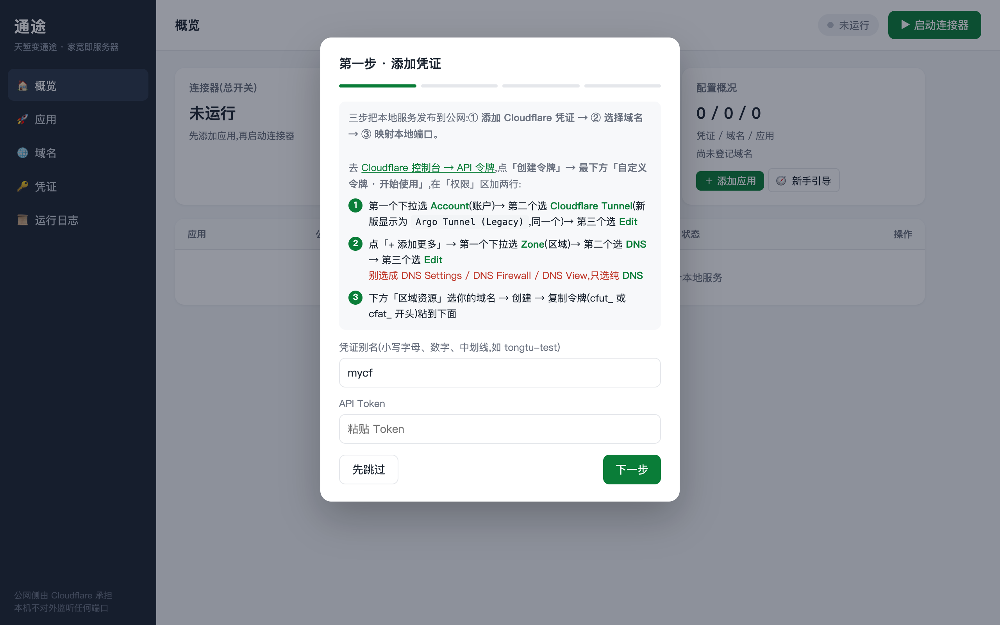
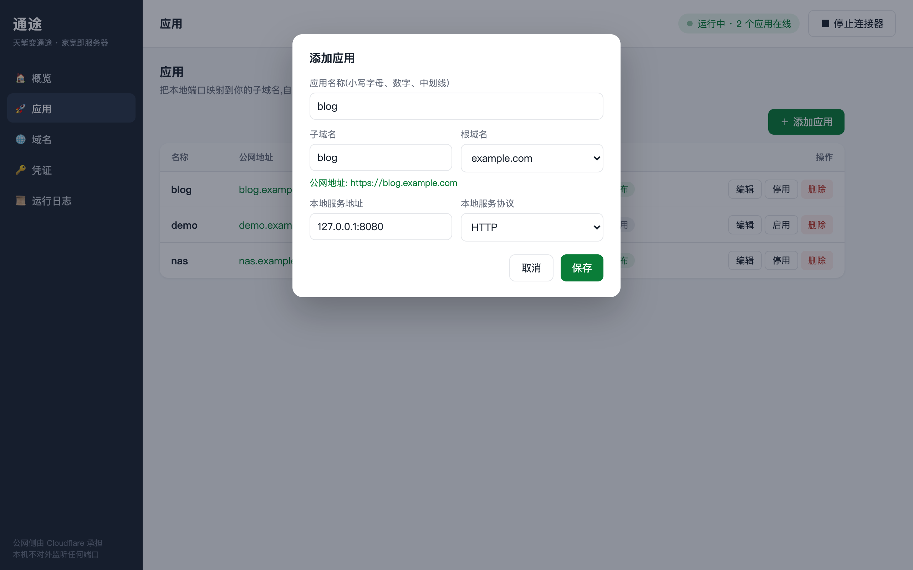
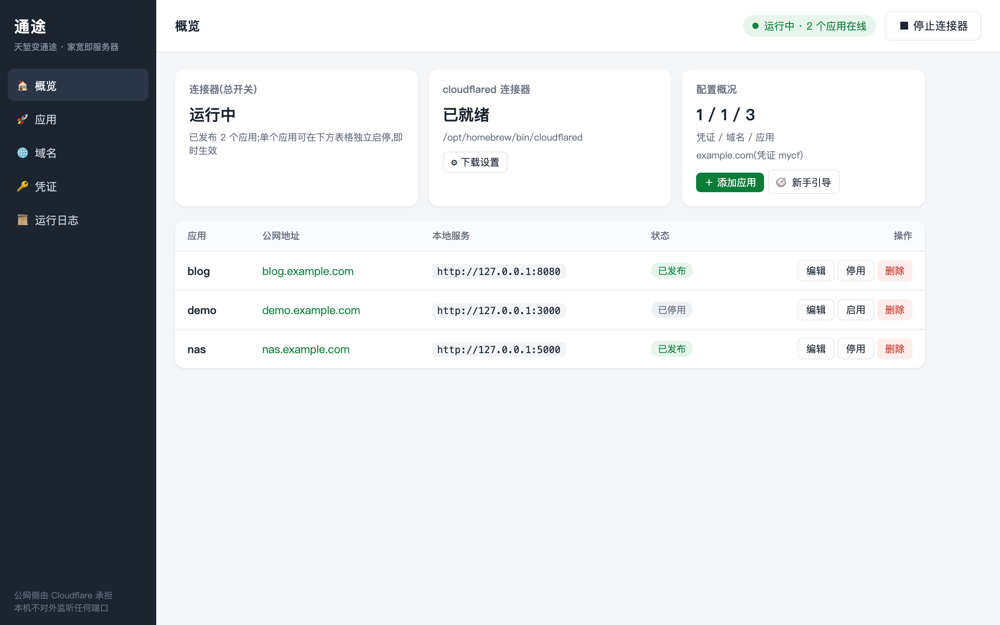
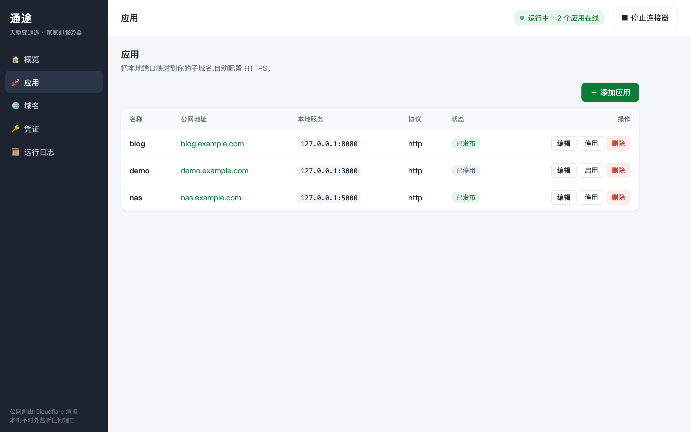
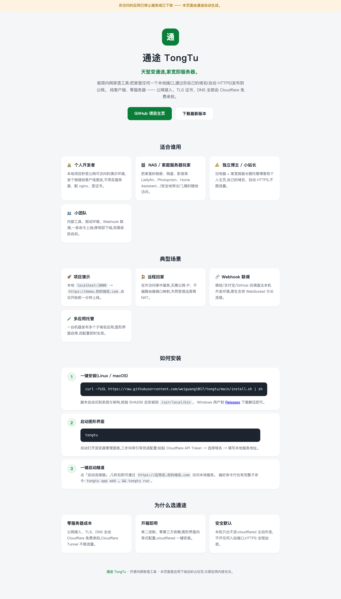

# 通途 TongTu

> **天堑变通途 —— 家宽即服务器。**
> *Your home broadband, served to the world.*

「通途」是一个极简的内网穿透工具:把家里任何一个本地端口,
通过你自己的域名(自动 HTTPS)暴露到公网。**纯客户端,无需自建服务器** ——
公网接入、TLS 证书、DNS 全部由 Cloudflare 免费承担。

**桌面客户端,开箱即用**:直接运行 `tongtu`(不带任何参数)即启动桌面客户端 ——
系统托盘常驻 + 原生窗口,首次使用有三步向导引导完成全部配置,cloudflared 连接器可一键安装。
**关闭窗口不会退出**:隧道在后台继续运行,托盘图标右键「退出」才真正退出;
托盘菜单还可一键开关「开机自启」(登录后静默启动到托盘)。

```
tongtu          # 启动桌面客户端:向导式配置 → 一键启动隧道 → 实时日志
```

服务器/无图形环境用 headless 版:`tongtu web` 启动纯浏览器面板,功能完全一致。

偏好命令行的用户,所有能力也都有对应子命令:

```
tongtu app add blog --domain blog.example.com --local 127.0.0.1:8080
tongtu run
✓ 通途已就绪: https://blog.example.com -> http://127.0.0.1:8080
```

## 一键安装(Linux / macOS,推荐)

```bash
curl -fsSL https://raw.githubusercontent.com/weiguang1017/tongtu/main/install.sh | sh
```

装的就是**桌面客户端**(系统托盘常驻 + 原生窗口),不是浏览器面板版。脚本会自动识别
系统与架构、下载最新 Release 并校验 SHA256:

- **macOS**:把 `TongTu.app` 安装到「应用程序」。装好后到「启动台 / 应用程序」打开「通途」即可(菜单栏出现托盘图标)。
- **Linux**(amd64):安装桌面二进制到 `/usr/local/bin` 并注册应用菜单图标与 `.desktop`,
  在应用菜单搜索「通途」启动;需要 GTK3 与 `libwebkit2gtk-4.0` 运行库。

可用环境变量定制:

```bash
TONGTU_VERSION=v0.0.7 sh install.sh                # 指定版本
TONGTU_APP_DIR=~/Applications sh install.sh        # macOS 改装到用户目录(免 sudo)
TONGTU_INSTALL_DIR=~/.local/bin sh install.sh      # Linux 自定义二进制目录 / CLI 软链目录
https_proxy=http://127.0.0.1:7890 sh install.sh    # 国内网络走代理下载
```

> 命令行同样可用:macOS 会把 CLI 软链到 `/usr/local/bin/tongtu`,Linux 直接就是二进制,
> `tongtu app add ...`、`tongtu run` 等子命令与桌面客户端共用同一份配置。

<details>
<summary><b>手动下载安装(含 Windows)</b></summary>

到 [Releases](https://github.com/weiguang1017/tongtu/releases) 页面下载带 `_desktop` 后缀、
对应你系统与架构的桌面包:

- **macOS**:`tongtu_<版本>_darwin_<arch>_desktop.dmg`(Apple 芯片选 `arm64`,Intel 选 `amd64`)。
  打开 dmg,把 `TongTu.app` 拖到「应用程序」软链上。**DMG 拖拽安装的 app 会带上 quarantine
  隔离标记**,因本应用无付费开发者证书,Gatekeeper 会拦截 —— 表现为**双击图标没有任何反应**
  (新版 macOS 如 26 不弹「已损坏」提示,直接静默失败;命令行运行则正常)。装完先执行一次:

  ```bash
  xattr -dr com.apple.quarantine /Applications/TongTu.app   # 去掉隔离标记,双击即可打开
  ```

  仍打不开(或图标带禁止标)时再补一步 ad-hoc 重签名:

  ```bash
  codesign --force --deep --sign - /Applications/TongTu.app
  ```

  (这正是一键脚本自动帮你做的两步,无需付费开发者证书;用一键脚本安装则无需手动执行。)
- **Windows**:`tongtu_<版本>_windows_<arch>_desktop.zip`,解压后运行 `tongtu-gui.exe`
  (桌面客户端,无控制台窗口);同目录的 `tongtu.exe` 是命令行版。需 WebView2 Runtime
  (Win10 21H1+ 系统自带)。
- **Linux**:`tongtu_<版本>_linux_amd64_desktop.tar.gz`,解压后运行 `./tongtu`;需 GTK3 与
  `libwebkit2gtk-4.0`。

> 服务器 / 无图形环境:下载不带 `_desktop` 后缀的 headless 包(六个系统架构组合),
> 解压后 `./tongtu web` 启动纯浏览器面板,功能完全一致。

</details>

## 桌面客户端

桌面版(Release 里带 `_desktop` 后缀的包)在三平台提供一致的形态:

- **托盘常驻**:启动后菜单栏/任务栏出现通途图标,菜单含「打开面板 / 启动·停止连接器 /
  开机自启 / 在浏览器中打开 / 退出」,连接器状态实时显示;
- **原生窗口**:管理界面在系统自带 WebView 中打开(macOS WKWebView / Windows WebView2 /
  Linux WebKitGTK),关窗后隧道照常运行,再点「打开面板」窗口即回;重复点击只会置前已开窗口;
- **开机自启**:托盘菜单勾选即可,登录后以 `tongtu --hidden` 静默启动到托盘
  (macOS 写 `~/Library/LaunchAgents/com.tongtu.desktop.plist`,Windows 写注册表
  `HKCU\...\Run`,Linux 写 `~/.config/autostart/tongtu.desktop`);
- **单实例**:重复启动会自动唤起已运行实例的窗口,不会出现双连接器。

平台注意事项:

- **macOS**:推荐用一键脚本(自动去 quarantine 隔离标记 + ad-hoc 重签名);若从
  `*_desktop.dmg` 拖入「应用程序」,因无付费开发者证书会带隔离标记被 Gatekeeper 拦下 ——
  典型表现是**双击图标没有任何反应**(新版 macOS 不弹「已损坏」提示,静默失败),终端执行一次
  `xattr -dr com.apple.quarantine /Applications/TongTu.app` 即可打开(仍不行再补
  `codesign --force --deep --sign - /Applications/TongTu.app`);
- **Windows**:zip 内含两个 exe —— `tongtu-gui.exe`(桌面客户端,无控制台窗口)与
  `tongtu.exe`(命令行)。需要 WebView2 Runtime(Win10 21H1+ 系统自带);
- **Linux**:需要 `libwebkit2gtk-4.0` 与 GTK3 运行库;GNOME 桌面托盘图标需要
  AppIndicator 扩展。无法满足时用 headless 版 `tongtu web` 即可。

## 快速上手:三步把本地服务发布到公网

> 准备工作(一次性,约 5 分钟):域名托管在 Cloudflare + 一个 API Token,
> 详见下方[前提条件](#前提条件一次性约-5-分钟)。

### 第 1 步 · 打开客户端,跟着向导走

从「启动台 / 应用程序 / 开始菜单」打开「通途」(或在终端运行 `tongtu`)。桌面客户端会
弹出**原生管理窗口**(内嵌系统 WebView,默认面板地址 `http://127.0.0.1:7080`,仅本机可访问),
菜单栏 / 任务栏同时出现托盘图标。首次使用自动弹出三步向导:粘贴 Cloudflare API Token →
选择域名(直接从你的 Cloudflare 账号读取,点选即可)→ 映射本地服务:



### 第 2 步 · 添加应用

填一个应用名和子域名、写上要转发的服务地址,公网地址实时预览。
服务地址不限本机:`127.0.0.1:8080` 或局域网里任何这台机器能访问的地址
(如 NAS 的 `192.168.1.10:5000`)都可以。
协议默认「自动检测」——保存时通途会探测本地服务说 HTTP 还是 HTTPS 并自动配置:



### 第 3 步 · 一键启动连接器

点右上角「▶ 启动连接器」。cloudflared 未安装?概览页可一键安装。
几秒后即可通过 `https://应用名.你的域名.com` 访问本地服务。

## 效果展示

**运行中的概览页**:隧道状态、连接器状态、配置概况一目了然,每个应用可独立启停、即时生效:



**应用管理**:增删改都在弹窗里完成,支持编辑、停用/启用、删除,连接器运行中操作即时同步到 Cloudflare:



**应用下线兜底页**:应用被停用或删除后,其子域名不会变成生硬的 404 ——
访客会看到一张自动生成的通途介绍页(适用人群、典型场景、如何安装使用),
重新启用应用后秒级恢复原服务:



## 命名与 SLOGAN

- **名称**:通途(TongTu)。取自"一桥飞架南北,天堑变通途"——家庭内网与公网之间
  隔着 NAT、动态 IP、封禁的 80/443 端口,这就是"天堑";通途负责架桥。
- **SLOGAN**:**天堑变通途,家宽即服务器。**

## 工作原理

```
 访客浏览器                Cloudflare 边缘                     家里 (tongtu)
──────────────           ──────────────────                 ─────────────────
https://blog.example.com ──▶ 全球边缘节点,自动 TLS
                             CNAME blog → <id>.cfargotunnel.com
                                    │
                                    ▼
                             Cloudflare Tunnel  ◀──外连──  cloudflared 子进程
                                                            (tongtu 自动托管)
                                                                 │
                                                                 ▼
                                                            127.0.0.1:8080 本地服务
```

tongtu 本身只做**编排**(纯 Go 标准库,零第三方依赖):

1. 调 Cloudflare API 创建(或复用)一条 Cloudflare Tunnel(每个凭证一条,所有应用共享);
2. 写入 ingress 规则:每个应用一条,如 `blog.example.com → http://127.0.0.1:8080`;
   兜底规则指向本机的「应用已下线」介绍页;
3. 创建 DNS CNAME:`blog → <tunnel_id>.cfargotunnel.com`(代理开启,TLS 自动签发);
4. 启动并托管 `cloudflared` 子进程维持隧道连接(意外退出自动重启,指数退避)。

- cloudflared **主动外连** Cloudflare,家里不需要公网 IP、不需要路由器端口映射;
- HTTPS 由 Cloudflare 边缘统一卸载,本地服务零证书配置;
- 转发目标不限于本机 —— 只要是 tongtu 所在机器能访问的地址即可,`--local` 可填
  `127.0.0.1:8080`,也可填 `192.168.1.10:5000` 这类内网其他主机(路由器、NAS、打印机…);
- 原生支持 WebSocket / SSE / 长连接(HTTP/2 + QUIC);
- Cloudflare Tunnel 免费、不限流量;
- 应用**停用或删除**后 DNS 保留,访客落到介绍页而不是无法访问;重新启用秒级恢复。

## 前提条件(一次性,约 5 分钟)

1. **域名托管在 Cloudflare**:有一个自己的域名,NS 已指向 Cloudflare(免费套餐即可)。
2. **API Token**:创建一个自定义 Token,授予两个权限:
   - **Cloudflare Tunnel → Edit**(Account 作用域;新版面板里显示为 *Argo Tunnel (Legacy)*,是同一权限)
   - **DNS → Edit**(Zone 作用域;注意别选成 *DNS Settings* 或 *DNS Firewall*,要选 **DNS**)

   两类令牌通途都支持:
   - **用户令牌**(`cfut_` 前缀):在 <https://dash.cloudflare.com/profile/api-tokens> 创建;
   - **账户令牌**(`cfat_` 前缀):在 `dash.cloudflare.com/<账户ID>/api-tokens` 创建,
     Cloudflare 推荐用于长期运行的服务集成(正是通途的场景)。
3. **cloudflared**:
   ```bash
   brew install cloudflared        # macOS
   # Linux/Windows 见 https://developers.cloudflare.com/cloudflare-one/connections/connect-networks/downloads/
   ```
   或者不装也行:图形界面里点「一键安装」,或 `tongtu run --auto-install`,
   都会自动下载官方二进制到 `~/.tongtu/bin/`。国内直连 GitHub 受限时,可在图形界面
   「概览 → ⚙ 下载设置」填本机代理(如 `http://127.0.0.1:7890`),下载即走该代理;
   或直接 `brew install cloudflared`。

## 图形界面功能一览

- **新手向导**:首次使用自动弹出,三步走完 凭证 → 域名 → 应用;
- **概览页**:隧道运行状态、cloudflared 连接器状态(未安装可一键安装)、配置概况一目了然;
- **应用 / 域名 / 凭证页**:全部增删改在弹窗里完成,应用支持启停切换与高级选项;
  域名可换绑凭证,删除有二次确认;
- **应用停用 / 删除即时生效**:连接器运行中,停用或删除应用即刻从 Cloudflare 下线;
  其域名保留解析,访客看到通途介绍页(彻底清理 DNS 可用 CLI `--purge-dns`);
- **协议自动探测**:添加应用时协议默认「自动检测」——保存时通途探测本地服务说 HTTP
  还是 HTTPS 并自动配置,免去手动选错导致的 502(源站 TLS 握手失败);
- **运行日志页**:通途与 cloudflared 的实时输出,排查问题不用回终端。

```bash
tongtu                  # 等价于 tongtu web --open
tongtu web              # 只启动服务,不自动开浏览器
```

默认只监听本机(`127.0.0.1:7080`);监听非本机地址时必须同时设置访问令牌:

```bash
tongtu web --addr 0.0.0.0:7080 --web-token <随机字符串>
# API 请求需带请求头 Authorization: Bearer <令牌>
```

## 快速上手(命令行)

```bash
# 1. 保存凭证(在线验证后存入 ~/.tongtu/config.json,权限 0600)
tongtu cred add mycf --token <你的 API Token>

# 2. 登记域名(验证该域名确实托管在你的 Cloudflare 账号下)
tongtu domain add example.com

# 3. 添加应用(可多个,共享一条隧道)
tongtu app add blog --domain blog.example.com --local 127.0.0.1:8080
tongtu app add nas  --domain nas.example.com  --local 192.168.1.10:5000

# 4. 运行全部已启用应用(前台阻塞,Ctrl-C 退出)
tongtu run
```

## 命令一览

| 命令 | 说明 |
|------|------|
| `tongtu cred add <别名> --token <T>` | 添加凭证(在线验证 Token) |
| `tongtu cred list` | 列出凭证(Token 打码显示) |
| `tongtu cred update <别名> --token <T>` | 更换 Token |
| `tongtu cred rm <别名>` | 删除凭证(被域名引用时拒绝) |
| `tongtu domain add <根域名> [--cred X]` | 登记域名(验证 Zone 与权限) |
| `tongtu domain list` | 列出已登记域名 |
| `tongtu domain rm <根域名>` | 移除登记(不动 Cloudflare 上的 Zone;被应用引用时拒绝) |
| `tongtu zones [--cred X]` | 列出凭证可见的全部可用域名 |
| `tongtu app add <名> --domain <FQDN> --local <地址>` | 添加应用(见下方参数) |
| `tongtu app list` | 列出应用 |
| `tongtu app update <名> [参数...]` | 修改应用 |
| `tongtu app enable/disable <名>` | 启用 / 停用(停用后域名显示通途介绍页) |
| `tongtu app rm <名> [--purge-dns]` | 删除应用(默认保留 DNS,域名显示介绍页;`--purge-dns` 彻底清理) |
| `tongtu run [应用名...]` | 同步 Cloudflare 配置并运行(默认全部已启用应用) |
| `tongtu status` | 查看各应用 DNS / 隧道就绪状态 |
| `tongtu`(无参数) | 启动图形管理界面并自动打开浏览器 |
| `tongtu web [--addr 127.0.0.1:7080] [--open]` | 启动图形界面(`--open` 自动打开浏览器) |

`app add / update` 参数:

| 参数 | 说明 | 默认 |
|------|------|------|
| `--domain` | 对外完整域名,如 blog.example.com,须属于已登记根域名 | — |
| `--local` | 要转发到的服务地址 `host:port`,可为本机或**任意本机能访问的内网地址**(如 `127.0.0.1:8080`、`192.168.1.10:5000`、`nas.local:5000`) | — |
| `--proto` | 本地服务协议 http / https / tcp | `http` |
| `--no-tls-verify` | 本地服务为自签 HTTPS 证书时跳过校验 | 关 |
| `--origin-server-name` | 源站 TLS 握手 SNI(证书域名与访问域名不一致时) | — |
| `--disable` | 添加后暂不启用 | 关 |

## 快捷模式(不落配置)

临时暴露单个端口,兼容旧用法:

```bash
export TONGTU_CF_TOKEN=<Token> TONGTU_DOMAIN=example.com
tongtu -name demo -local 127.0.0.1:3000 -cleanup   # -cleanup: 退出时删除隧道与 DNS
```

## SSL / 证书说明

- **访客侧 HTTPS**:证书由 Cloudflare 边缘自动签发、自动续期,零配置;
- **源站 TLS**(本地服务本身是 HTTPS 时):`--proto https` 连接本地服务;
  自签证书加 `--no-tls-verify`;证书域名与访问域名不一致时用 `--origin-server-name` 指定 SNI。
- **常见 502(Bad Gateway)**:日志里出现 `tls: first record does not look like a TLS handshake`,
  说明源站协议配反了——本地是明文 HTTP 却按 HTTPS 连接。图形界面把应用协议改为「自动检测」
  重新保存即可自动纠正;CLI 则 `tongtu app update <名> --proto http`。

## 构建

```bash
make build        # headless 版 bin/tongtu(纯 Go,零 CGO)
make linux        # 交叉编译 bin/tongtu-linux-amd64 / arm64(headless)
make desktop      # 本平台桌面版(macOS/Linux 需 CGO;Linux 需 libgtk-3-dev libwebkit2gtk-4.0-dev)
make desktop-win  # 交叉编译 Windows 桌面版双 exe(纯 Go,任意平台可执行)
make mac-app      # 组装 dist/TongTu.app
make mac-dmg      # 打包 dmg
make icons        # 从 assets/icon/*.svg 重新生成全部图标(需 brew install librsvg)
make vet
```

## 自动构建与发布

GitHub Actions 会在推送代码或提交 PR 时,在 Linux / macOS / Windows 三平台自动执行
测试、`go vet` 与桌面版编译。推送 `v*` 标签会自动生成两类安装包并发布到 GitHub Release:
桌面版(macOS dmg/app zip、Windows 双 exe zip、Linux tar.gz,带 `_desktop` 后缀)
与 headless 版(六个系统/架构组合,纯 Go 交叉编译):

```bash
git tag v0.1.0
git push origin v0.1.0
```

## 开机自启

**桌面版**:托盘菜单勾选「开机自启」即可,无需手动配置。

**headless/服务器场景(macOS)**:先用 CLI 完成配置,再安装 LaunchAgent(开机执行
`tongtu run`):见 [`deploy/com.tongtu.client.plist`](deploy/com.tongtu.client.plist)。
不要与桌面版的「开机自启」同时启用,否则登录后会运行两份连接器。

## 安全须知

- **API Token 就是钥匙**:它能改你的 DNS 和隧道,请按最小权限创建并限定到具体 Zone;
  `~/.tongtu/config.json` 保存着 Token(0600 权限),不要提交进仓库或同步到不可信设备;
- 通往 Cloudflare 的隧道链路全程加密(cloudflared ↔ CF 边缘为 TLS);
- 暴露到公网的本地服务自身要有认证 —— 通途只负责"能访问",不负责"该不该访问";
  需要访问控制可在 Cloudflare Zero Trust 控制台给对应 hostname 加 Access 策略;
- Web 面板监听非本机地址时强制要求 `--web-token`;
- 应用下线介绍页是通途内建的一个迷你静态服务,**只绑定本机回环地址**(`127.0.0.1`,
  与应用要转发的 `--local` 无关),仅经隧道对外,不含任何本机信息;
- 注意:流量会经过 Cloudflare(其边缘终止 TLS),对 Cloudflare 不可见的端到端加密
  不在本工具范围内。

## 路线图

- [ ] `tongtu status` 显示 cloudflared 实时连接状态与流量统计
- [ ] TCP 任意端口转发的访客侧引导(`cloudflared access tcp`)
- [ ] TryCloudflare 免域名快速模式(随机 `*.trycloudflare.com` 地址)
- [ ] 配置导入 / 导出与多机同步
